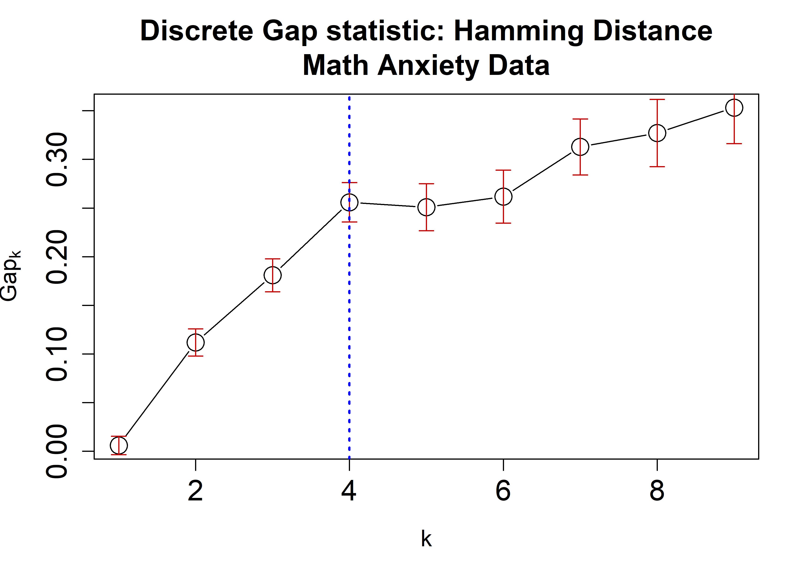
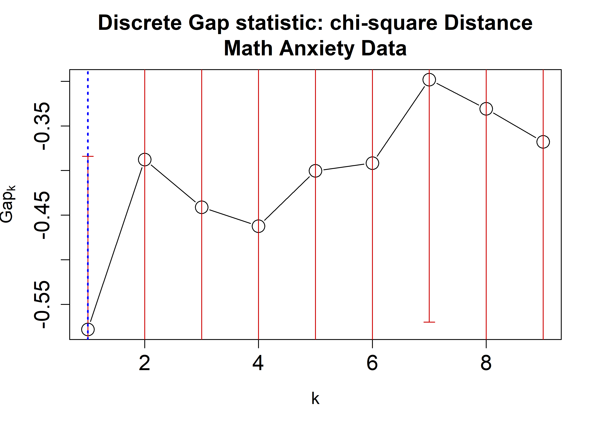
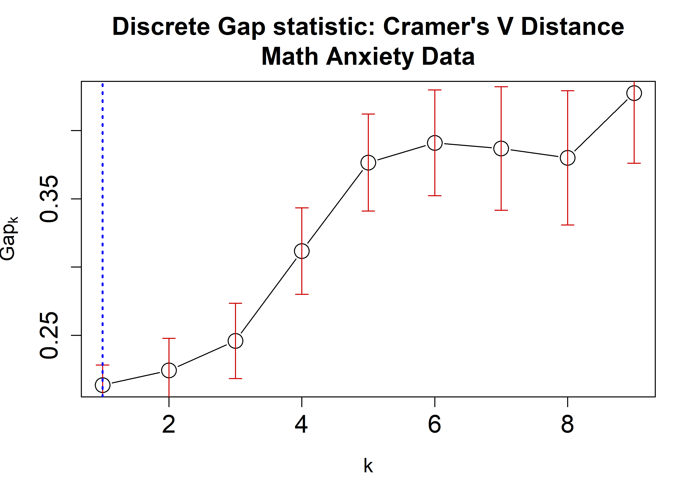
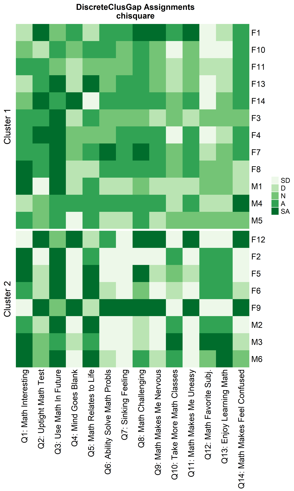
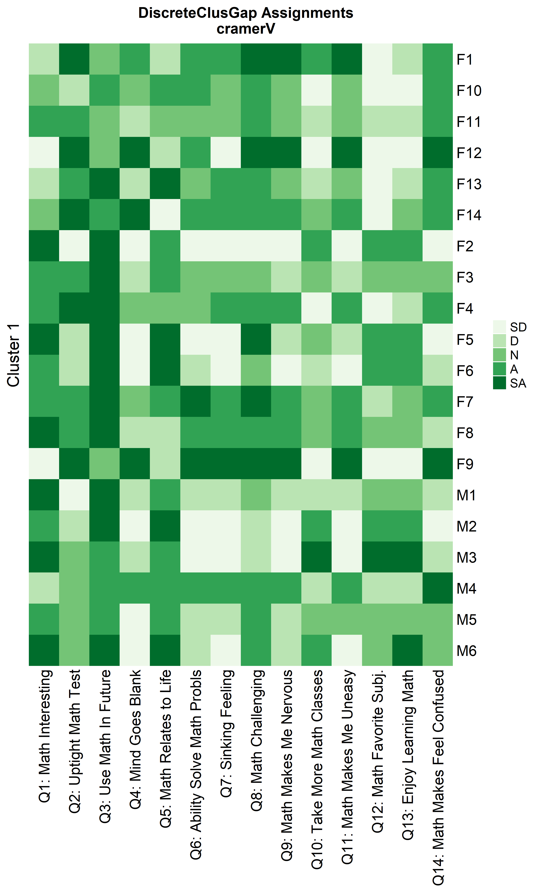
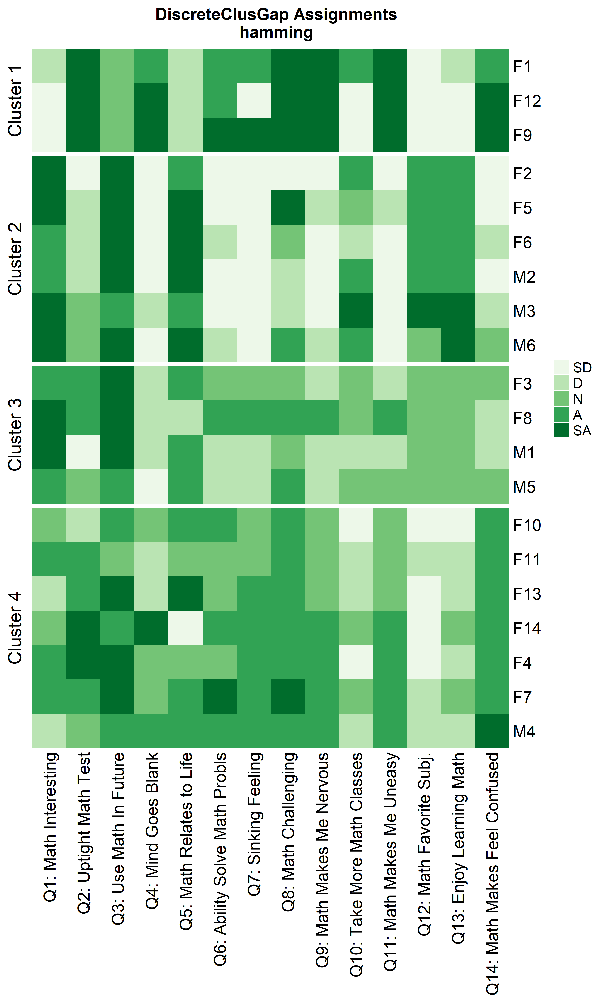
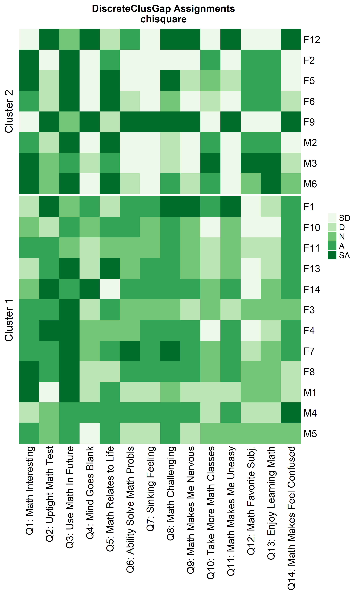

<!-- README.md is generated from README.Rmd. Please edit that file -->

# DiscreteGapStatistic

<!-- badges: start -->
<!-- badges: end -->

DiscreteGapStatistic estimates the number of clusters from (multiple
choice) categorical response format data given any clustering algorithm
extending the well-known gap statistic using a discrete distance based
approach.

## Installation

You can install the development version of DiscreteGapStatistic from
[GitHub](https://github.com/) with:

``` r
# install.packages("devtools")
devtools::install_github("ecortesgomez/DiscreteGapStatistic")
```

# Example: Math Anxiety Data

## Summarization and Data Exploration

Basic usage of `DiscreteGapStatistic` is shown using `likert`’s Math
Anxiety data.

``` r
library(DiscreteGapStatistic)
library(dplyr)
#> 
#> Attaching package: 'dplyr'
#> The following objects are masked from 'package:stats':
#> 
#>     filter, lag
#> The following objects are masked from 'package:base':
#> 
#>     intersect, setdiff, setequal, union
```

Libraries are uploaded. Questions are lightly reformatted and the
categories are shortened.

``` r
## mass dataset is loaded automatically with DiscreteGapStatistic

massQ <- colnames(mass)
massQsh <- c('Gender',
             'Q1: Math Interesting', 'Q2: Uptight Math Test', 'Q3: Use Math In Future',
             'Q4: Mind Goes Blank', 'Q5: Math Relates to Life', 'Q6: Ability Solve Math Probls',
             'Q7: Sinking Feeling', 'Q8: Math Challenging', 'Q9: Math Makes Me Nervous',
             'Q10: Take More Math Classes', 'Q11: Math Makes Me Uneasy','Q12: Math Favorite Subj.',
             'Q13: Enjoy Learning Math', 'Q14: Math Makes Feel Confused')

massData <- mass
colnames(massData) <- massQsh
Cats <- setNames(object = c('SD', 'D', 'N', 'A', 'SA'),
                 nm = c('Strongly Disagree', 'Disagree', 
                        'Neutral', 
                        'Agree', 'Strongly Agree') )
massData <- data.frame(Gender = massData$Gender,
                       apply(massData[, -1], 2,
                             function(x) Cats[as.character(x)] %>%
                                factor(levels = Cats)),
                       check.names=FALSE)

rownames(massData) <- c(paste0('F', 1:2), paste0('M', 1),
                        paste0('F', 3:11), paste0('M', 2),
                        paste0('F', 12), paste0('M', 3),
                        paste0('F', 13), paste0('M', 4:5),
                        paste0('F', 14), paste0('M', 6))
```

## Likert Heatmap

The dataset is visualized using a heatmap similar to the one produced by
`likert::likert.heatmap.plot`.

``` r
library(ggplot2)
likert.heat.plot2(massData[, -1],
                  allLevels = Cats,
                  text.size = 1.5)+
   labs(title = 'Math Anxiety Data Likert Heatmap Summary')+
   theme(axis.text = element_text(size = 6), 
         title = element_text(size = 6))
```


## Distance Matrices

Five categorical distance functions are introduced to quantify
dissimilarities/discrepancies between two categorical vectors (see
function `distancematrix`). The following table describes the available
distances and the names used within the package.

    #> 
    #> Attaching package: 'kableExtra'
    #> The following object is masked from 'package:dplyr':
    #> 
    #>     group_rows

<table class=" lightable-paper" style="font-family: &quot;Arial Narrow&quot;, arial, helvetica, sans-serif; width: auto !important; margin-left: auto; margin-right: auto;">
<thead>
<tr>
<th style="text-align:left;">
Distance
</th>
<th style="text-align:left;">
Name
</th>
</tr>
</thead>
<tbody>
<tr>
<td style="text-align:left;border-left:1px solid;">
Hamming
</td>
<td style="text-align:left;font-family: monospace;border-left:1px solid;border-right:1px solid;">
hamming
</td>
</tr>
<tr>
<td style="text-align:left;border-left:1px solid;">
chi-square
</td>
<td style="text-align:left;font-family: monospace;border-left:1px solid;border-right:1px solid;">
chisquare
</td>
</tr>
<tr>
<td style="text-align:left;border-left:1px solid;">
Cramer’s V
</td>
<td style="text-align:left;font-family: monospace;border-left:1px solid;border-right:1px solid;">
cramerV
</td>
</tr>
<tr>
<td style="text-align:left;border-left:1px solid;">
Hellinger
</td>
<td style="text-align:left;font-family: monospace;border-left:1px solid;border-right:1px solid;">
hellinger
</td>
</tr>
<tr>
<td style="text-align:left;border-left:1px solid;">
Bhattacharyya
</td>
<td style="text-align:left;font-family: monospace;border-left:1px solid;border-right:1px solid;">
bhattacharyya
</td>
</tr>
</tbody>
</table>

The resulting distance matrix from a rectangular dataset can easily be
displayed and organized using heatmaps. The following plots visualize
the `massData` using the defined distances with the function
`distanceHeat`. This function only requires the dataset object and the
name of the distance. It can also take advantage of the options and
functionalities available in the `pheatmap` function (see the code
below) from the `pheatmap` R package \[@kolde2019\]. For instance, by
default, the columns are clustered using
`clustering_method = 'complete'` but this parameter can be specified
according to `pheatmap`’s options. Different aesthetic options are
exemplified in the plots below using the introduced distances.

``` r
distanceHeat(x = massData[, -1], distName = 'hamming',
             main = 'Hamming Distance\nMath Anxiety Data', fontsize = 6.5)

distanceHeat(x = massData[, -1], distName = 'cramerV',
             main = "Cramer's V Distance\nMath Anxiety Data", fontsize = 6.5, 
             show_rownames = FALSE, cluster_rows = FALSE, cluster_cols=FALSE)
```


``` r
distanceHeat(x = massData[, -1], distName = 'hellinger',
             main = 'Hellinger Distance\nMath Anxiety Data', fontsize = 6.5, 
             show_rownames = TRUE, border_color = 'black', 
             , cluster_rows = FALSE, cluster_cols=FALSE)

distanceHeat(x = massData[, -1], distName = 'bhattacharyya',
             main = 'Bhattacharyya Distance\nMath Anxiety Data', fontsize = 6.5, 
              show_rownames = TRUE, border_color = 'lightgrey', 
             , cluster_rows = FALSE, cluster_cols=FALSE)
```


# `clusGapDiscr`: The Gap Statistic for discrete data

The Gap Statistic (GS) in its original formulation by Tibshirani et. al
aims to determine an optimal number of clusters given a rectangular
dataset with continuous columns and a pre-specified clustering method
given $k$ number of clusters (i.e. $k$-means clustering or partitioning
around medoids (pam)). This is done by comparing the within-cluster
dispersion of the data to a randomly generated reference null
distribution of the data obtaining estimations via bootstrapping. The
idea is to quantify whether the clustering structure observed in the
data is considerably different compared to what would be expected by
random chance. `clusGap` is a widely used implementation of the GS from
the `cluster` package \[@maechler2023cluster\] with the following basic
arguments:

``` r
clusGap(x, FUNcluster, K.max, B = 100, 
        verbose = interactive(), ...)
```

- `x`: argument can be `data.frame` or `matrix` object where rows
  represent observations and columns correspond to data features or
  variables. This matrix is expected to be contain exclusively numerical
  input.
- `FUNcluster`: clustering function accepting on its first argument a
  rectangular data object (like `x`) and a second one specifying a
  desired `k` number of clusters.  
- `K.max`: maximum number of clusters to consider.  
- `B`: integer indicating the number of times to perform the Montecarlo
  repetitions.

The discrete GS (dGS) proposed applies and adapts the principle behind
the original formulation, but for categorical data using a
distance-based approach. The GS assumes that the distance between
observations can be correctly described with the Euclidean distance,
since it assumes the data is continuous. In the case of categorical
data, this distance assumption is not appropriate and a different class
of distances needs to be defined. `clusGapDiscr` is the main function
that performs and implements dGS. Parameters `x`, `K.max` and `B` found
in `clusGapDiscr` have the same meaning and usage to the ones found in
`clusGap`. `clusterFUN` expects the name of a well-known clustering
algorithm implementation available in `R` amenable to the proposed
methodology. The input options available for this parameter are the
following:

<table class=" lightable-paper" style="font-family: &quot;Arial Narrow&quot;, arial, helvetica, sans-serif; width: auto !important; margin-left: auto; margin-right: auto;">
<caption>
List of appliable clustering algorithms for DiscreteGapStatistic
</caption>
<thead>
<tr>
<th style="text-align:left;">
clusterFUN
</th>
<th style="text-align:left;">
Package
</th>
</tr>
</thead>
<tbody>
<tr>
<td style="text-align:left;">
pam
</td>
<td style="text-align:left;">
cluster
</td>
</tr>
<tr>
<td style="text-align:left;">
fanny
</td>
<td style="text-align:left;">
cluster
</td>
</tr>
<tr>
<td style="text-align:left;">
diana
</td>
<td style="text-align:left;">
cluster
</td>
</tr>
<tr>
<td style="text-align:left;">
agnes-{average, single, complete, ward, weighted}
</td>
<td style="text-align:left;">
cluster
</td>
</tr>
<tr>
<td style="text-align:left;">
hclust-{average, single, complete, ward.D, ward.D2, mcquitty, median,
centroid}
</td>
<td style="text-align:left;">
stats
</td>
</tr>
<tr>
<td style="text-align:left;">
kmodes-{1, 2, …, }
</td>
<td style="text-align:left;">
klaR
</td>
</tr>
</tbody>
</table>

The first four options are straight-forward since originally these
functions can output a clustering partition providing a distance matrix
and a given number of clusters. The following two implementations use a
flexible hierarchical clustering strategy. The number of desired
clusters can be obtained appropriately by cutting the resulting
hierarchical tree. This parameter requires the name of the
implementation and a dash (-) followed by the exact name of the
clustering strategy described in the package corresponding R package.
Lastly, a k-modes implementation is included using code found on `klaR`
with options `fast=TRUE, weighted = FALSE`. The expected string after
the dash is a non-negative integer specifying the maximum number of
iterations to carry out within the algorithm (`iter.max` option;
inputting `kmodes` alone runs `iter.max = 10` by default).

Additionally, the function requires a categorical distance from the list
mentioned above. Another feature of the dGS is the reference null
distribution used, which can be a discrete uniform distribution of the
unique column-wise categories found in the data; this setting is defined
as the Data Support (DS). In other settings, the categories to be used
must be user-specified via a character vector or list. This setting will
be referred as the Known Support (KS).

``` r
clusGapDiscr(x, clusterFUN, K.max, B = nrow(x),
             distName, value.range = 'DS', 
             verbose = interactive(), useLog = TRUE ...)
```

- `distName`: name of discrete distance. The available options are
  `'hamming'`, `'chisquare'`, `'cramersV'`, `'bhattacharyya'` and
  `'hellinger'`.

- `value.range`: specifies the values of the reference null
  distribution. Possible values: `'DS'` or a character vector with
  unique values. `'DS'` option extracts the unique values found in `x`.

- `useLog`: Binary truth variable specifying whether to evaluate the Gap
  Statistic with or without $log$ function.

Similar to `clusGap`, `clusGapDiscr` returns a matrix object with
`K.max` rows corresponding to the user-specified number of clusters with
an estimate of the GS and its corresponding standard error. This
information would then determine the number of clusters according to the
cluster-selection criterion. The one used in `DiscreteGapStatistic` is
the 1-SE criterion implemented by the function `findK`, which accepts
`clusGap` objects. The following example applies the dGS on the Math
Anxiety data using the Hamming, $\chi^2$, and Cramer’s V distances
applying the `cluster::pam` algorithm. A plot is then generated
displaying the dGS against the number of clusters. Each estimate is
accompanied by corresponding standard-error bars and a blue dashed line
indicating the chosen number of clusters.

## Basics

The math anxiety data is further explored under different categorical
distances using the `cluster::pam` algorithm. The number of bootstraps
`B` is increased to `100` since the sample size for this dataset is not
too large. The maximum number of clusters to consider is `9`.

``` r
## Recall Cats:
# Cats <- setNames(object = c('SD', 'D', 'N', 'A', 'SA'),
#                  nm = c('Strongly Disagree', 'Disagree', 
#                         'Neutral', 
#                         'Agree', 'Strongly Agree') )

HammRun <- clusGapDiscr(x = massData[, -1],
                        clusterFUN = 'pam',
                        B = 100,
                        K.max = 9,
                        value.range = 'DS',
                        distName = 'hamming')
#> Found levels: A, D, N, SA, SD
```

``` r

chisqRun <- clusGapDiscr(x = massData[, -1],
                        clusterFUN = 'pam',
                        B = 100,
                        K.max = 9,
                        value.range = Cats,
                        distName = 'chisquare')
#> Found levels: A, D, N, SA, SD
```

``` r

crVRun <- clusGapDiscr(x = massData[, -1],
                        clusterFUN = 'pam',
                        B = 100,
                        K.max = 9,
                        value.range = 'DS',
                        distName = 'cramerV')
#> Found levels: A, D, N, SA, SD
```

``` r

plot(HammRun,
     main = "Discrete Gap statistic: Hamming Distance\nMath Anxiety Data",
     cex = 2, cex.lab=1.2, cex.axis=1.5, cex.main=1.5)
abline(v = findK(HammRun), lty=3, lwd=2, col="Blue")

plot(chisqRun,
     main = "Discrete Gap statistic: chi-square Distance\nMath Anxiety Data",
     cex = 2, cex.lab=1.2, cex.axis=1.5, cex.main=1.5)
abline(v = findK(chisqRun), lty=3, lwd=2, col="Blue")

plot(crVRun,
     main = "Discrete Gap statistic: Cramer's V Distance\nMath Anxiety Data",
     cex = 2, cex.lab=1.2, cex.axis=1.5, cex.main=1.5)
abline(v = findK(crVRun), lty=3, lwd=2, col="Blue")
```



Notice that since all possible categorical values are available in the
data, using the option `value.range = Cats` would yield exact same
results.

Heatmaps can be created to visualize the commonalities within each
cluster and the differences between them.

``` r

ResHeatmap(x = massData[, -1],
           distName = 'hamming',
           clusterFUN = 'pam', 
           catVals = Cats,
           nCl = findK(HammRun),
           out = 'heatmap',
           prefObs = NULL, height = 6)
#> Warning: The input is a data frame-like object, convert it to a matrix.
#> Warning: Note: not all columns in the data frame are numeric. The data frame
#> will be converted into a character matrix.
```

``` r

ResHeatmap(x = massData[, -1],
           clusterFUN = 'pam', 
           distName = 'chisquare',
           catVals = Cats,
           nCl = findK(chisqRun),
           out = 'heatmap',
           prefObs = NULL, height = 6)
#> Warning: The input is a data frame-like object, convert it to a matrix.
#> Warning: Note: not all columns in the data frame are numeric. The data frame
#> will be converted into a character matrix.
```

``` r

ResHeatmap(x = massData[, -1],
           clusterFUN = 'pam', 
           distName = 'cramerV',
           catVals = Cats,
           nCl = findK(crVRun),
           out = 'heatmap',
           prefObs = NULL, height = 6)
#> Warning: The input is a data frame-like object, convert it to a matrix.
#> Warning: Note: not all columns in the data frame are numeric. The data frame
#> will be converted into a character matrix.
```



## Re-arranging clusters

Notice that Hamming distance detects subclusters present in Cluster 2
from the $\chi^2$ distance run. To compare the similar clusters
side-to-side, the parameter `nCl` can be used to reorder the clusters
relative to the given ordering. This case `nCl = 2:1` will alter
(invert) the order of the two clusters on the $\chi^2$ based cluster. A
third heatmap is displayed relabeling the clusters from the $\chi^2$ run
using the `clusterNames = 'renumber'` argument.

``` r

ResHeatmap(x = massData[, -1],
           clusterFUN = 'pam', 
           distName = 'hamming',
           catVals = Cats,
           nCl = findK(HammRun),
           out = 'heatmap', 
           height = 6)

ResHeatmap(x = massData[, -1],
           clusterFUN = 'pam', 
           distName = 'chisquare',
           catVals = Cats,
           nCl = 2:1,
           out = 'heatmap', 
           height = 6)

ResHeatmap(x = massData[, -1],
           clusterFUN = 'pam', 
           distName = 'chisquare',
           catVals = Cats,
           nCl = 2:1,
           clusterNames = 'renumber',
           out = 'heatmap',
           height = 6)
```



## Alternative clustering algorithms

Other compatible clustering algorithms are considered additional to
`cluster::pam` only using the Hamming distance.

### Other `cluster` algorithms: `diana` and `fanny`

``` r

hDiaMa <- clusGapDiscr(massData[, -1], 'diana', K.max = 9, B = 100)
ResHeatmap(x = massData[, -1],
           distName = 'hamming',
           clusterFUN = 'diana',
           catVals = Cats,
           nCl = findK(hDiaMa),
           out = 'heatmap',
           height = 6)

hFanMa <- clusGapDiscr(massData[, -1], 'fanny', K.max = 9, B = 100)
ResHeatmap(x = massData[, -1],
           clusterFUN = 'fanny',
           distName = 'hamming',
           catVals = Cats,
           nCl = findK(hFanMa),
           out = 'heatmap', 
           height = 6)
```


### Hierarchical Clustering

``` r
hAgnComMa <- clusGapDiscr(massData[, -1], 'agnes-complete', K.max = 9, B = 100)
ResHeatmap(x = massData[, -1],
           distName = 'hamming',
           clusterFUN = 'agnes-complete',
           catVals = Cats,
           nCl = findK(hAgnComMa),
           out = 'heatmap',
           height = 6)

hhclComMa <- clusGapDiscr(massData[, -1], 'hclust-complete', K.max = 9, B = 100)
ResHeatmap(x = massData[, -1],
           distName = 'hamming',
           clusterFUN = 'hclust-complete',
           catVals = Cats,
           nCl = findK(hhclComMa),
           out = 'heatmap',
           height = 6)

hhclMcqMa <- clusGapDiscr(massData[, -1], 'hclust-mcquitty', K.max = 9, B = 100)
ResHeatmap(x = massData[, -1],
           distName = 'hamming',
           clusterFUN = 'hclust-mcquitty',
           catVals = Cats,
           nCl = findK(hhclMcqMa),
           out = 'heatmap', 
           height = 6)
```


